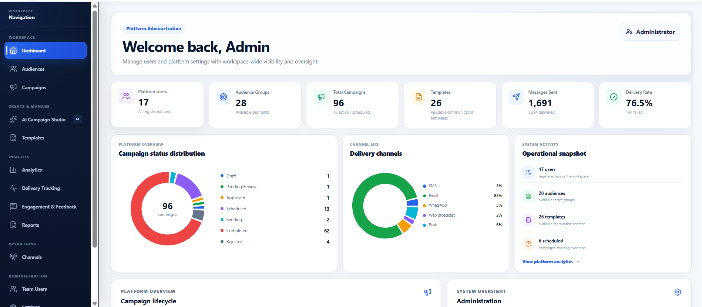
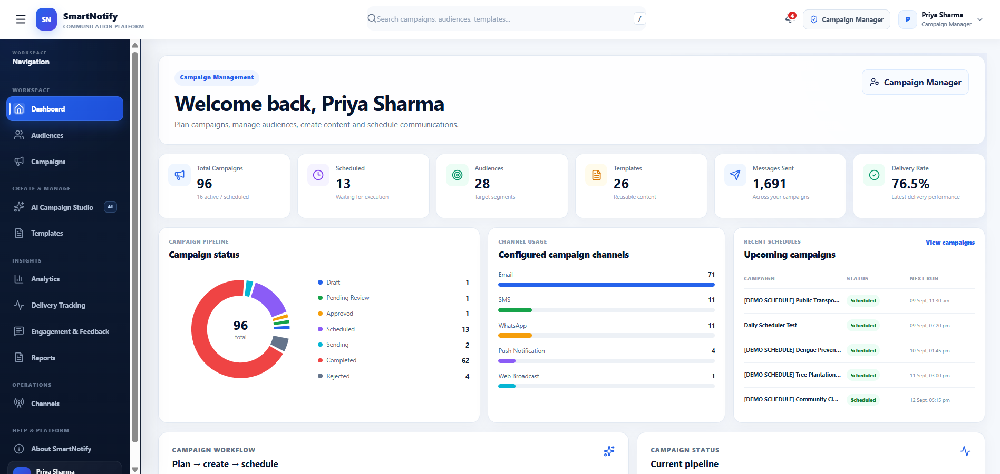
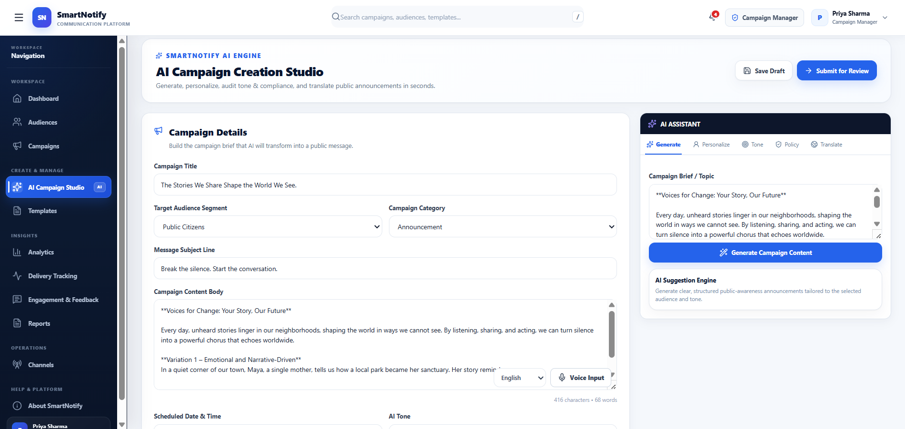
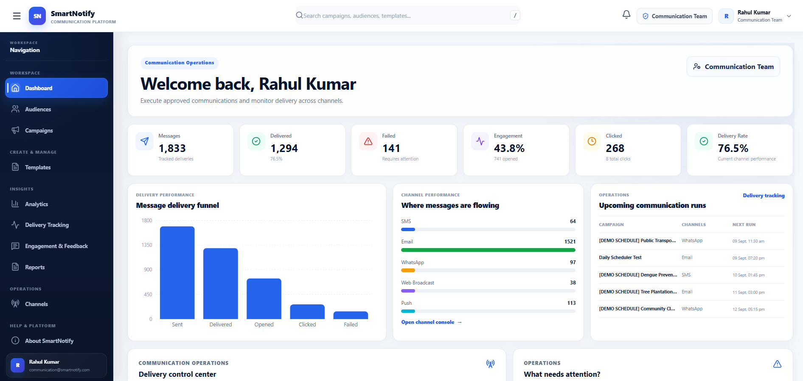
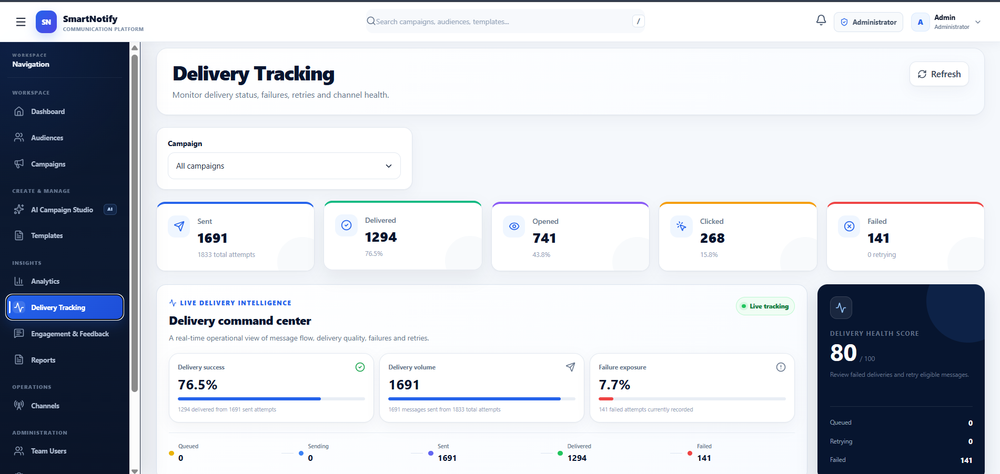
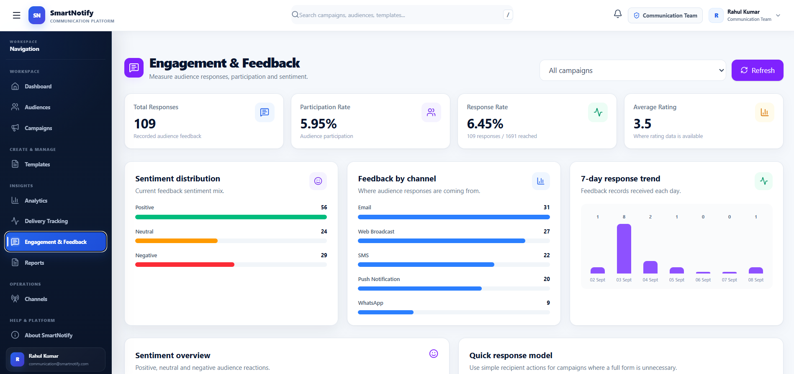

<div align="center">

<h1>📣 SmartNotify — AI-Powered Multi-Channel Communication Platform</h1>

<p><em>Role-based campaign management with AI content generation, translation, and multi-channel delivery — all under controlled approval</em></p>


**[📦 Installation](#-installation) · [✨ Features](#-features) · [🏗️ Architecture](#️-system-architecture) · [📸 Screenshots](#-screenshots) · [🔄 Workflow](#-application-workflow)**

</div>

---

## 📌 Overview

**SmartNotify** is a role-based communication management platform that brings **campaign creation, AI-assisted content generation, translation, audience management, multi-channel delivery, feedback collection, and reporting** into a single controlled workflow.

Instead of juggling separate tools for drafting, translating, approving, and tracking messages, SmartNotify centralizes the entire campaign lifecycle behind role-based access control — from **Draft → Submitted → Approved → Sent → Completed**.

> Built as a full-stack capstone project: React + FastAPI + PostgreSQL + GenAI, with JWT-based RBAC across four distinct roles.

---

## 📸 Screenshots

|Admin Dashboard | Campaign Dashboard|
|---|---|
|  |  |

| AI Studio | Communication Dashboard |
|---|---|
|  |  |

| Delivery Tracking | Feedback  |
|---|---|
|  |  |

---

## ✨ Features

| Feature | Description |
|---|---|
| 🤖 **AI Content Generation** | Provide a topic or instruction and generate ready-to-use campaign content, editable before submission |
| 🌍 **AI Translation** | Translate campaign content into multiple languages while preserving the original message |
| ✅ **Campaign Approval Workflow** | Separates creation from approval — Administrators review every campaign before it's delivered |
| 📡 **Multi-Channel Delivery** | Reach audiences over **Email, SMS, WhatsApp, Push, and Web Broadcast** from one campaign |
| 👥 **Audience Management** | Organize recipients into audiences and target campaigns precisely |
| 📋 **Reusable Templates** | Standardize frequently used message formats and speed up campaign creation |
| ⏰ **Scheduling** | Plan campaigns in advance instead of sending immediately |
| 📊 **Delivery Tracking** | Monitor message status — `Pending`, `Sent`, `Delivered`, `Failed` — in real time |
| 💬 **Feedback & Engagement** | Collect and review user responses, including feedback across languages |
| 📈 **Reports & Analytics** | Turn campaign activity into actionable insight on delivery, engagement, and performance |
| 🔐 **JWT-Based RBAC** | Four scoped roles keep each user limited to functionality relevant to their responsibilities |

---

## 👥 Roles

| Role | Responsibilities |
|---|---|
| 🛡️ **Administrator** | Manage users, review campaigns, approve/reject, monitor the platform |
| 📝 **Campaign Manager** | Create campaigns, use AI content tools, select audiences, submit for review |
| 📡 **Communication Team** | Handle campaign delivery and communication operations |
| 👤 **User** | Receive communication and provide feedback |

---

## 🏗️ System Architecture

```
┌──────────────────────────────┐
│          Frontend            │
│        React + Vite          │
│  Dashboard · Campaigns · AI Studio
│  Audiences · Templates · Delivery Tracking
│  Feedback · Reports & Analytics · Users
└──────────────┬───────────────┘
               │  REST API
               ▼
┌──────────────────────────────┐
│           Backend            │
│        FastAPI / Python      │
│  Auth (JWT) · Campaigns · Audiences
│  AI Services · Translation · Delivery
│  Scheduling · Feedback · Reporting
└──────────────┬───────────────┘
               ▼
┌──────────────────────────────┐
│          Database            │
│         PostgreSQL           │
│  Users · Campaigns · Audiences
│  Templates · Deliveries · Feedback
│  Notifications
└──────────────────────────────┘
```

---

## 🛠️ Technology Stack

| Layer | Technology |
|---|---|
| **Frontend** | React, Vite, JavaScript, CSS, REST API integration |
| **Backend** | Python, FastAPI, SQLAlchemy, Alembic |
| **Database** | PostgreSQL |
| **AI** | GenAI content generation, AI-assisted translation |
| **Communication** | Email, SMS, WhatsApp, Push Notifications, Web Broadcast |
| **Auth & Security** | JWT-based RBAC, protected routes, environment-based configuration |

`react` `vite` `javascript` `fastapi` `python` `sqlalchemy` `alembic` `postgresql` `jwt` `rbac` `genai` `multilingual` `email` `sms` `whatsapp` `push-notifications` `web-broadcast` `campaign-management`

---

## 📁 Project Structure

```
AI-Mass-Communication/
│
├── backend/
│   ├── app/
│   │   ├── database/
│   │   ├── models/
│   │   ├── routers/        → ai, audience, campaign, channels, dashboard,
│   │   │                      delivery, feedback, notification, template,
│   │   │                      tracking, users, webhook
│   │   ├── schemas/
│   │   ├── services/       → ai_service, broadcast_service, campaign_delivery,
│   │   │                      communication_service, email_service,
│   │   │                      firebase_service, notification_service,
│   │   │                      scheduler, sms_service, translation_service,
│   │   │                      whatsapp_service
│   │   └── utils/
│   ├── alembic/versions/
│   ├── alembic.ini
│   ├── requirements.txt
│   └── .env.example
│
├── frontend/
│   ├── public/
│   ├── src/
│   │   ├── components/
│   │   ├── context/
│   │   ├── hooks/
│   │   ├── layouts/
│   │   ├── pages/
│   │   ├── services/
│   │   ├── styles/
│   │   └── utils/
│   ├── package.json
│   ├── vite.config.js
│   └── .env.example
│
└── README.md
```

---

## 🚀 Installation

### Prerequisites
- Python 3.x
- Node.js & npm
- Git
- PostgreSQL (or another supported relational database)

### 1. Clone the Repository
```bash
git clone https://github.com/charishmasai99/AI-Mass-Communication.git
cd AI-Mass-Communication
```

### 2. Backend Setup
```bash
cd backend
python -m venv venv
source venv/bin/activate        # Linux / Mac
venv\Scripts\activate           # Windows

pip install -r requirements.txt
cp .env.example .env            # fill in DB, auth, AI, and communication credentials

alembic upgrade head
uvicorn app.main:app --reload
```
- API → `http://localhost:8000`
- Docs (Swagger) → `http://localhost:8000/docs`

### 3. Frontend Setup
```bash
cd frontend
npm install
cp .env.example .env
npm run dev
```
- App → `http://localhost:5173`

---

## 🔄 Application Workflow

```
1. Login              → Role-based access is applied immediately
2. Create Campaign    → Campaign Manager fills in details
3. Generate/Translate → AI Studio drafts + translates content
4. Select Audience    → Target the right recipient group
5. Submit Campaign    → Sent for administrative review
6. Admin Approval     → Approved or Rejected
7. Delivery           → Communication Team sends via selected channels
8. Engagement         → Users receive messages & submit feedback
9. Reports            → Activity, delivery, and feedback reviewed
```

---

## 🧪 Testing & Validation Checklist

- [ ] Authentication & JWT session handling
- [ ] Role-based access across all four roles
- [ ] Campaign creation, approval, and rejection
- [ ] AI content generation & translation accuracy
- [ ] Audience selection and template reuse
- [ ] Scheduling and delivery across all channels
- [ ] Retry/failure handling on failed deliveries
- [ ] Feedback submission and multilingual handling
- [ ] Reports and analytics accuracy
- [ ] End-to-end workflow (draft → delivered → feedback)

---

## 🔒 Security

- Role-based authorization on every protected route
- JWT-based authentication and session handling
- Environment-based secret configuration — credentials never hardcoded
- Mandatory approval step before any campaign is delivered
- Restricted access to administrative functions

**Never commit:** `.env`, `firebase-service-account.json`, database files, `seed_demo*.py`, `reset_passwords.py`, or any other private credentials.

---

## 🗺️ Roadmap

- [ ] Expand AI translation language coverage
- [ ] Per-channel engagement comparison dashboards
- [ ] Webhook-based delivery status callbacks for all channels
- [ ] Bulk audience import/export (CSV)
- [ ] In-app notification center for approval requests
- [ ] Automated A/B testing for campaign content

## 📋 Changelog

| Version | Notes |
|---|---|
| `v1.0.0` | Initial capstone release — campaign workflow, AI content & translation, multi-channel delivery, JWT RBAC, reporting |

*(Update this table as new versions ship.)*

---

## 🤝 Contributing

```bash
git checkout -b feature/my-feature
git commit -m "Add: my feature"
git push origin feature/my-feature
# → Open a Pull Request on GitHub
```

Avoid committing secrets, local databases, dependency folders, generated files, or personal configuration.

---

## 📄 License

This project is developed for academic/project purposes.

---

## 👩‍💻 Author

**Sai Charishma T**
B.Tech Computer Science Engineering · Final Year, Class of 2027
📍 Rajahmundry, Andhra Pradesh, India

[](https://github.com/charishmasai99)

---

<div align="center">
  <sub>Built with 💙 for clearer, controlled communication · React · FastAPI · PostgreSQL · GenAI</sub>
</div>